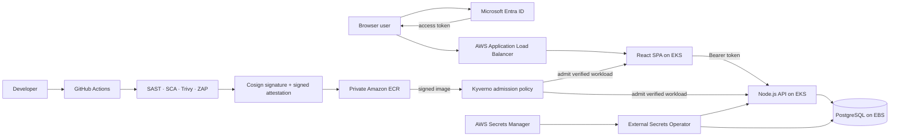

# DevSecOps Security Lab

A hands-on DevSecOps showcase built around a deliberately vulnerable React,
Node.js and PostgreSQL application. The application provides something concrete
to protect; the main focus is the security pipeline, software-supply-chain
integrity, cloud identity, Kubernetes admission control and AWS infrastructure.

> Personal learning project inspired by enterprise security patterns. The
> insecure REST and GraphQL routes are intentional test targets and are not
> production examples.

## What this demonstrates

- GitHub Actions pipeline integrating Semgrep SAST, `npm audit` SCA, Trivy
  container scanning and OWASP ZAP DAST.
- Review gates and a signed `vuln-signoff/v1` attestation recording accepted
  security outcomes.
- Cosign keyless signing through GitHub OIDC/Sigstore, with images stored in
  private Amazon ECR under immutable full-Git-SHA tags.
- Kyverno admission enforcement that verifies the image signature and
  vulnerability attestation before allowing an application Pod to run.
- Terraform-provisioned VPC, EKS, IAM/OIDC/IRSA, ECR, Secrets Manager, ALB and
  EBS resources.
- External Secrets Operator synchronizing AWS Secrets Manager values into
  Kubernetes without storing live secret values in Git.
- Microsoft Entra ID SPA authentication, API token validation, delegated OAuth
  scopes and `Wardrobe.Reader` / `Wardrobe.Creator` application roles.
- Secure and intentionally insecure REST/GraphQL implementations for comparing
  authentication, authorization and SQL-injection controls.

## Architecture at a glance

DNS resolves the public lab hostname to the ALB but is not a traffic proxy.
EKS nodes and VPC-CNI Pod addresses live in private subnets; the ALB and NAT
Gateway use public subnets. The ALB targets Pods directly by IP.

## Proven outcome

The complete pipeline was demonstrated successfully in security-pipeline run
**#157** for commit `719f8a91afb10b859ca22af7037a4731a1d92fc8`.
At runtime, Kyverno was `Ready=True` in `Enforce` mode:

- the signed and attested frontend/backend images were admitted and ran;
- an unsigned backend image was rejected by a server-side admission dry-run;
- a Reader token could read but not modify wardrobe data;
- a Creator token could read and modify wardrobe data.

The EKS portion is intentionally ephemeral and can be destroyed after each lab
session while the base IAM, ECR and Terraform state remain available.

## Repository map

| Path | Purpose |
|---|---|
| `.github/workflows/security-pipeline.yml` | Scan, build, sign, attest and update a running deployment |
| `.github/workflows/deploy-lab.yml` | Provision/start the lab and deploy a verified release |
| `terraform/infra-base/` | Persistent ECR, GitHub OIDC/IAM and teardown automation |
| `terraform/infra-lab/` | Ephemeral VPC, EKS, IAM/IRSA, secrets and controllers |
| `k8s/` | Application, ingress, External Secrets and Kyverno manifests |
| `helm/` | Controller configuration |
| `frontend/` | React SPA and MSAL integration |
| `backend/` | Express REST/GraphQL API and JWT authorization |
| `postgredb/` | PostgreSQL initialization |
| `bin/` | Operational helper scripts |
| `docs/` | Architecture, evidence, decisions, deep dives and runbooks |

## Run the lab

The normal workflow is:

1. Run `security-pipeline.yml` and copy the full Git-SHA image tag printed by
   its attestation summary.
2. Run `deploy-lab.yml` with that tag, your current public IP as a `/32`, and
   Terraform enabled when creating a fresh cluster.
3. Stop the ephemeral environment with `bin/stoplab.sh` when finished.

Exact commands, prerequisites and recovery notes are in the
[operations guide](docs/OPERATIONS.md).

## Documentation

- [Technical inventory and evidence](docs/DEVSECLAB_INVENTORY.md)
- [Architecture and design](docs/Architecture.md)
- [Identity, trust and secrets](docs/IDENTITY_TRUST_AND_SECRETS.md)
- [Cosign signing deep dive](docs/COSIGN_SIGNING_DEEP_DIVE.md)
- [Kyverno deep dive](docs/KYVERNO_DEEP_DIVE.md)
- [Security decisions and accepted lab risks](docs/LAB_SECURITY_DECISIONS.md)
- [Current session state](docs/SESSION_STATE.md)

## Deliberate limitations

This remains a learning environment rather than a production platform. Known
hardening opportunities include least-privilege GitHub deployment roles,
private/restricted EKS API access, Kubernetes NetworkPolicies and stronger Pod
Security settings, removal of the CI-only DAST authentication bypass from the
production artifact, dependency modernization, automated unit/integration
tests, and broader runtime observability.
